# Architecture

- [Main README](../../README.md)
- [Valid ANPR JSON format](ANPR_JSON_FORMAT.md)
- [Tests](TESTS.md)

## High-Level Architecture

```mermaid
---
title: High-Level Architecture Flowchart
---
flowchart TD;
    A["👤 User"];
    B["🌐 NGINX Static files<br>Front End"];
    C["📦 .NET<br>Frond End Web API"];
    D[("🗄️ MariaDB<br>Docker image")];

    A --> B;
    B --> C;
    C --> D;

    I["💻 Python<br>Front End (builder)"]
    I -->|builds<br>static files| B

    E["📦 .NET<br>Data Processor Web API"]
    F["💻 .NET<br>ANPR Enricher App"]

    F --> E
    E --> D

    G["🌐 phpMyAdmin<br>Docker image"];
    H["👤 Admin"]
    H --> G
    G --> D
```

### Zoom to subsystem:
- [Python & NGINX Front End (builder)](../../AnprFrontEnd/README.md)
- [.NET Front End Web API](../../PolAssessment/AnprFrontEnd.WebApi/README.md)
- [.NET ANPR Enricher App](../../PolAssessment/AnprEnricher.App/README.md)
- [.NET Data Processor Web API](../../PolAssessment/AnprDataProcessor.WebApi/README.md)
- [MariaDB](https://hub.docker.com/_/mariadb) (image: mariadb:lts)
- [phpMyAdmin](https://hub.docker.com/_/phpmyadmin): (image: phpmyadmin:latest)
