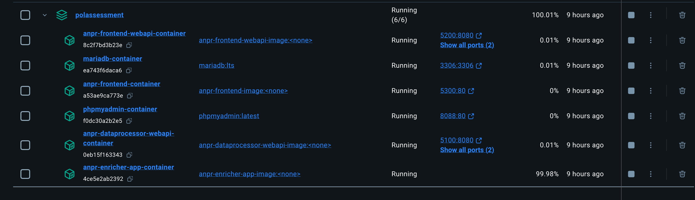
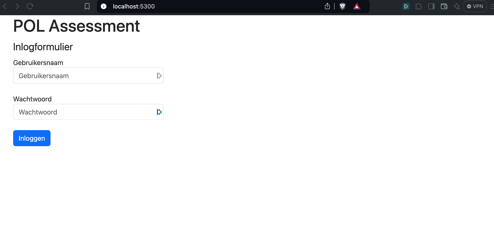
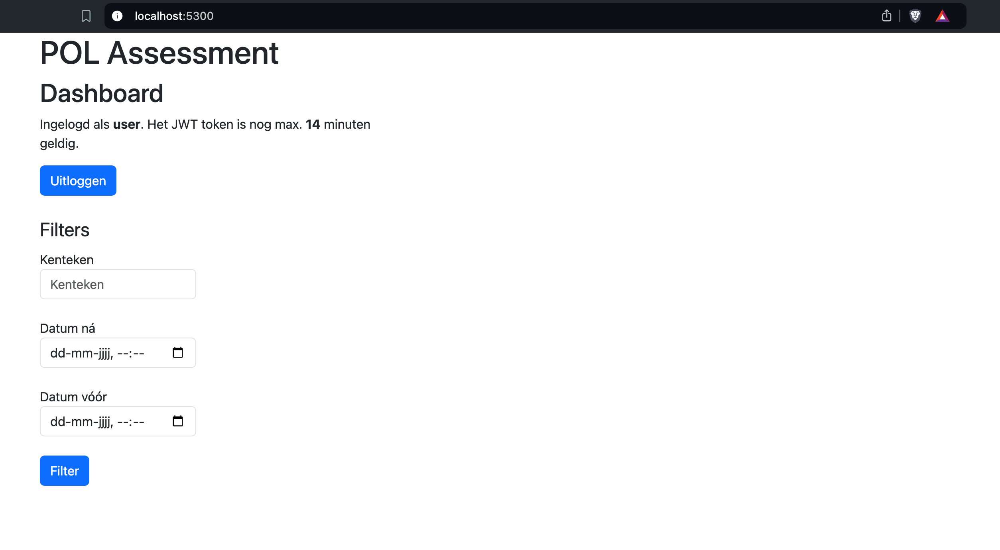
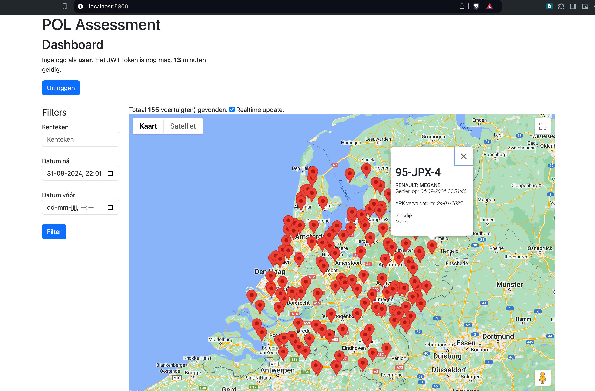

# Usage

- [Main README](../../README.md)
- [Install with Docker](DOCKER.md)

(Docker only!)

## Docker Desktop
If you use a GUI application like Docker Desktop, you should see something like:

## Drop tgz zipped files
The container named `anpr-enricher-app-container` should have a _Bind mount_ with a local path in the host. After obtaining or generating valid tgz zipped ANPR JSON files like described in the [Data Generator](../../DataGenerator/README.md), just paste these tgz files into the bound "Hot Folder" called *HotFolderTgz*.

This action will trigger the [`anpr-enricher-app`](../../PolAssessment/AnprEnricher.App/) to unpack these zipped files, read the JSON files, enrich them and sending the enriched data to [`anpr-dataprocessor-webapi`](../../PolAssessment/AnprDataProcessor.WebApi/).

## Use the Front End
Considering the Docker Desktop screenshot, one can see that the `anpr-frontend-container`'s tcp port 80 is mapped to 5300, which means that in this case, the ANPR Front End is available at http://localhost:5300/.

After browsing to that location, one should see a login screen (unless a valid JWT token is already available):

After successfully login, you should see the initial dashboard looking similar like:

When filling in the filter on the left, a Google Map should be presented with some markers. When clicking on a marker, a popup will appear with all the enriched data.

When the "Realtime update" check box is checked, all newly uploaded enriched data that meet with the filter's settings, will automatically appear on the Google Map with another color marker.
