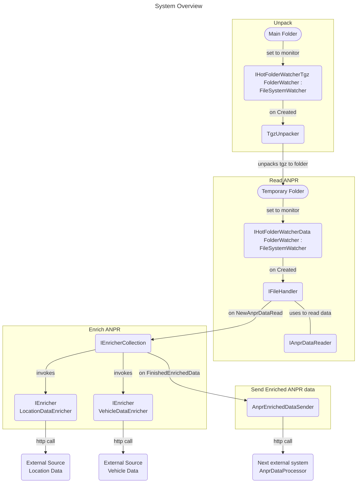

# ANPR Enricher
AnprEnricher is a .NET console project within the solution called PolAssessment.

## Description
This system:
1. handles tgz-files dropped in a certain folder
2. unpacks those tgz-files
3. reads the unpacked ANPR data
4. enriches the ANPR data with external sources
5. sends the enriched data to the next system: AnprDataProcessor



## Installation

### Prerequisites:
Obtain a valid Api Key from api.geoapify.com and put the API Key as value:
```json
{
  "LocationEnricher":
  {
    "ApiKey": "<< SECRET, override in appsettingsSecrets.json >>"
  }
}
```

### Locally
Make sure you fill in the hotfolder paths correctly in either the appsettings.json or appsettingsSecrets.json:
```json
{
  "HotFolder":
  {
    "TgzPath": "/Users/your_user_name/your_path/PolAssessment/HotFolders/HotFolderTgz",
    "DataPath": "/Users/your_user_name/your_path/PolAssessment/HotFolders/HotFolderData"
  }
}
```

Build and run the .NET console project:
```sh
dotnet restore
dotnet build
dotnet run
```

### Docker
Run within Docker. Caution: on a Windows-based host the FileSystemWatcher will not be invoked properly. Please use a work around for Windows-based systems using Docker installation. In this proposed workaround, the Filebrowser is used instead of a binding of a host path.

#### Build image

Build the image with the following command in the solution directory, where the file Dockerfile-AnprEnricher is.
```sh
docker build -f Dockerfile-AnprEnricher -t anpr-enricher-image .
```

#### Run application within Docker

Run the application with bind mount. Replace /path/on/your/host with the path you want to bind on your host.
```sh
docker run -v /path/on/your/host:/app/HotFolders anpr-enricher-image
```

or, when using a Windows-based host, just expose port 8080 in order for Filebrowser to be exposed.
```sh
docker run -d -p 8080:8080 anpr-enricher-image
```

Instead of just running the application, please use the docker-compose option for the yml file.
```sh
# List al Docker networks
docker network ls

# There should be a network called pol-assessment-network
# if not, create it first:
docker network create pol-assessment-network

# Then compose the image
docker-compose up -d
```

## Usage
Drop a tgz-packed file with ANPR data in the hot folder and if all configuration is set correctly, the data should be enriched and passed through to the next system.

When using a Windows-based host on Docker: instead of dropping the tgz-packed file in a folder, upload the tgz file using the Filebrowser.

As for the ANPR data, use this JSON format:
```json
{
    "Plate": "X-123-XX",
    "Coordinates": {
        "Latitude": 52.0246,
        "Longitude": 4.1750
    },
    "DateTime": "2024-08-01T12:00:00"
}
```
